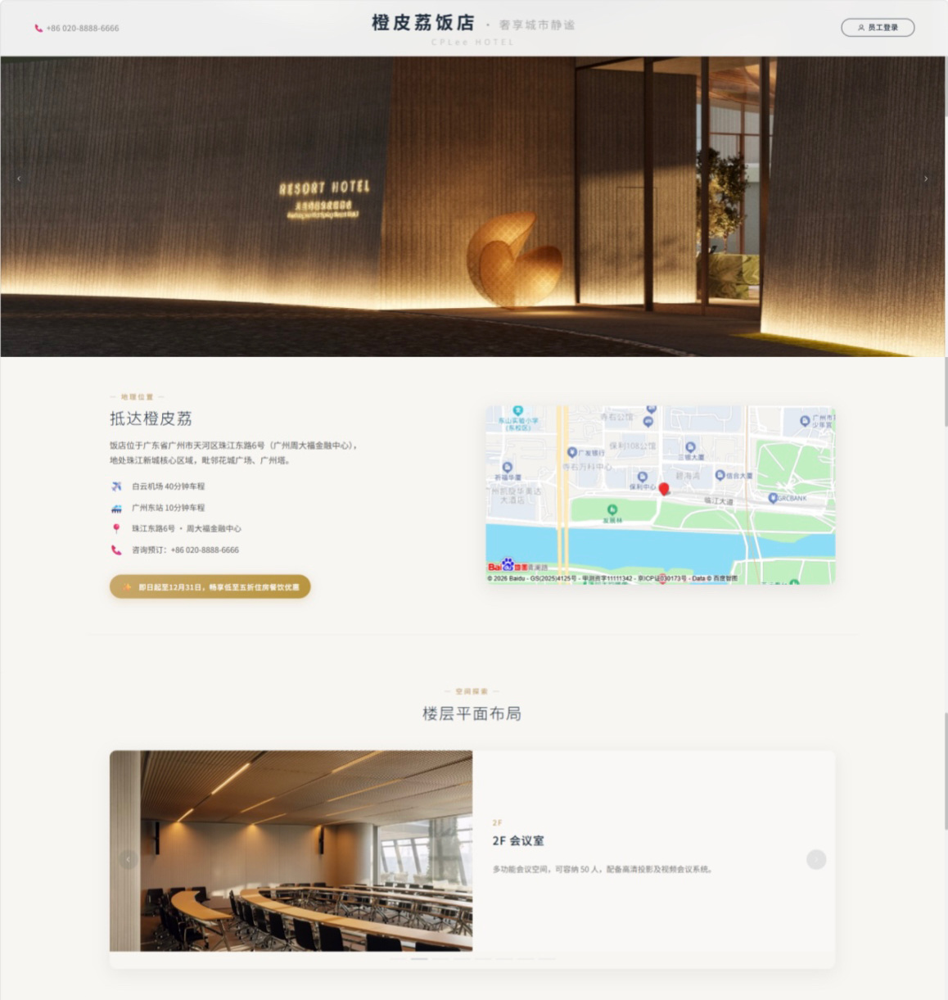

# 🏨 酒店后台管理系统

> 基于 Spring Boot + Vue 3 + MySQL 的全栈酒店 PMS 管理系统，覆盖预订入住、餐饮、KTV、库存、员工考勤工资、总经理数据看板六大业务域，4 种角色权限隔离，Docker Compose 三容器编排部署。

[](https://adoptium.net/)
[](https://spring.io/projects/spring-boot)
[](https://www.mysql.com/)
[](LICENSE)

---

## 系统截图



---

## 系统角色

### 1. 前台接待员
- 散客/团队预订、入住办理、换房、续房
- 房态图（楼层分布、房间状态、在住客人）
- 预订取消、留言管理、物品损坏登记

### 2. 营业服务员
- 菜单点菜（库存自动扣减、售罄下架）
- KTV 包厢开台/关台/计时计费
- 仓库管理（入库/出库/库存预警）
- 待结账单查看

### 3. 财务管理
- 在住客人账单查询（房费、餐饮、KTV、杂费）
- 结账预览与结算、押金管理
- 员工管理（入职/离职/信息维护）
- 考勤打卡与月工资核算、工资表 Excel 导出

### 4. 总经理
- KPI 驾驶舱（今日营收、入住率等）
- 收入构成分析、客源分布统计
- 入住率趋势（日/月粒度）
- 员工房间配比
---

## 核心业务流程

### 订单状态转换图

本系统的核心业务流程围绕房间状态和客人状态转换展开。以下是完整的订单生命周期：

```
                    ┌─────────────────────────────┐
                    │      预订创建 / 散客开单       │
                    │  guest.status = "已预订"       │
                    │  room.status = 空闲(不变)      │
                    └──────────────┬────────────────┘
                                   │
                       ┌───────────┴────────────┐
                       │                        │
              ┌────────┴────────┐     ┌─────────┴──────────┐
              │   办理入住       │     │    取消预订         │
              │ guest → "在住"  │     │ guest → "已取消"    │
              │ room  → "占用"  │     │ room = 空闲(不变)   │
              └────────┬────────┘     └────────────────────┘
                       │
              ┌────────┴────────┐     ┌────────────────────┐
              │    客人退房      │     │      续房          │
              │ guest → "已退房" │     │ pre_leave_date 延期 │
              │ room  → "空闲"  │     └────────────────────┘
              └────────┬────────┘
                       │
              ┌────────┴────────┐
              │    财务结账      │
              │ order → "已结算"│
              └─────────────────┘
```

### 状态定义

| 实体 | 状态值 | 说明 |
| :--- | :--- | :--- |
| **Guest** | 已预订 | 客人已预订，尚未入住 |
| | 在住 | 客人已办理入住 |
| | 已退房 | 客人已办理退房 |
| | 已取消 | 预订已被取消 |
| | 已锁 | 团队预订时锁定的房间 |
| **OrderMain** | 未结算 | 入住时自动创建，待财务结账 |
| | 已结算 | 财务已完成结账 |
| **Room** | 空闲 | 房间可用 |
| | 占用 | 有客人正在入住 |
| | 维修中 | 房间处于维修状态 |
| | 打扫中 | 退房后清洁中 |

### 注意事项
- 预订与入住分离：预订时仅更新 Guest 状态，不修改 Room 的物理状态。入住时才将 Room 更新为占用。
- 财务结算独立于退房流程：退房仅更新客人状态，结算在财务模块完成。

## 特殊特性

### 并发安全
- 数据库行级锁（SELECT...FOR UPDATE）防房间超售，并发压测验证零超售
- 原子条件更新（UPDATE...WHERE quantity>=#num）防库存超卖
- 接口幂等方案（唯一键去重），网络重试场景下入住/下单零重复处理

### 安全防御
- JWT 无状态认证，支持水平扩展
- 用户名 + IP 双维度失败计数，3 次错误触发验证码
- IP 60 次/分钟接口限流
- XSS 参数过滤
- 全局异常脱敏，不泄露内部信息

### 可观测性
- 审计日志模块：自动记录所有写操作的操作人、耗时、客户端 IP、业务结果
- 7 个 JUnit 单元测试（H2 内存库），覆盖可用房间、库存扣减、幂等去重、结账计算等核心逻辑

## 关键架构设计决策

### 并发控制：为什么选择数据库行级锁

我们选择了 **SELECT...FOR UPDATE 数据库行级锁** 来解决房间超售和库存超卖问题，理由是：

- 本阶段项目为单体架构，数据库是唯一的状态中心，在数据库层面锁定是最直接可靠的方式
- 相比分布式锁（如 Redis），行级锁无需引入额外的缓存组件，降低系统复杂度
- 行级锁仅锁定具体的记录，不会阻塞其他房间的操作，性能影响可控
- 配套幂等方案（唯一键去重），解决网络重试导致的重复请求问题

未来若迁移到微服务架构，可将行级锁升级为 Redis 分布式锁，保证跨服务的原子性。

### 安全认证：为什么选择 JWT 无状态认证

我们选择了 **JWT（JSON Web Token）+ BCrypt** 作为认证和密码存储方案，理由是：

- **无状态认证**：服务端不需要存储 Session，利于水平扩展，新增服务实例无需处理会话共享
- **Token 滑动过期**：剩余时间少于 5 分钟时自动续期，兼顾体验与安全
- **BCrypt 加盐**：密码存储采用 BCrypt（strength=10），即使数据库被暴露，密码也无法反向还原
- **双维度暴力破解防护**：在 JWT 认证基础上，加装用户名 + IP 双维度失败计数，3 次错误触发验证码，配合 IP 60次/分钟接口限流，构建多层防御

### 可观测性：为什么做审计日志

我们引入了 **Servlet Filter + 自定义审计日志表** 来记录所有写操作，理由是：

- 酒店管理系统涉及财务和客户数据，操作可追溯是合规基本要求
- 采用 Filter 方式实现，对业务代码零侵入，无需在每个控制器中手动注入
- 记录字段包含操作人、耗时、客户端 IP、业务结果，覆盖常规审计要求

---

## 技术栈

| 技术 | 说明 |
| :--- | :--- |
| **Java 17** | 后端开发语言 |
| **Spring Boot 2.7** | 核心框架 |
| **MyBatis-Plus** | ORM 持久层框架 |
| **MySQL 8.0** | 关系型数据库 |
| **H2** | 单元测试内存数据库 |
| **Vue 3 + Element Plus** | 前端框架与 UI 组件库 |
| **Docker** | 容器化部署 |
| **JUnit 5** | 单元测试 |

---

## 快速开始

### 1. 克隆项目
```bash
git clone git@github.com:jtchen11/hotel-backend.git
cd hotel-backend
```

### 2. 初始化数据库
```sql
CREATE DATABASE resturant_system DEFAULT CHARACTER SET utf8mb4;
```

执行 sql/ 目录下的初始化脚本。

### 3. 配置文件
```bash
cp .env.example .env
```

修改 `.env` 中的数据库密码和 JWT 密钥。

### 4. 启动后端
```bash
mvn spring-boot:run
```

### 5. 启动前端
```bash
cd hotel-frontend
npm install
npm run dev
```

访问 `http://localhost:5173`，默认员工密码 `123456`。

## Docker 部署

```bash
docker-compose up -d
```

## 项目结构

```
hotel-backend/
├── src/                     # Java 源代码
├── sql/                     # 数据库初始化脚本
├── hotel-frontend/          # Vue 3 前端
├── test/performance         # .py脚本(含压测)
├── run-tests.bat            # 测试启动脚本
├── docker-compose.yml       # Docker 编排
├── Dockerfile               # Docker 镜像构建
├── nginx.conf               # Nginx 配置
├── pom.xml                  # Maven 依赖管理
└── README.md                # 项目说明
```

## 运行测试

```bash
# 单元测试（H2 内存库）
mvn test

# 并发压测（需先启动后端）
python concurrency_test.py
```

## V2.0 规划方向：从管理工具到客户预订平台

### C端拓展
当前系统面向酒店内部员工，V2.0 将向客户端开放，实现客人自助预订、线上支付、入住提前办理。

### 小程序端
计划新增微信小程序端，覆盖更广的用户触达渠道，降低客户下单门槛。

### 架构演进
当业务规模扩张后，将考虑将单体架构拆分为微服务，例如将订单、库存、财务等模块独立部署，引入消息队列处理跨服务的事务一致性问题。

### 智能化探索
引入数据分析与 AI，实现动态定价、住客消费行为分析、客户偏好推荐，提升酒店营收管理能力。

## 已知局限与未来规划

### 测试覆盖
单元测试目前集中在核心业务模块（可用房间查询、库存原子扣减、幂等去重、结账计算、登录失败计数），尚未覆盖所有边界情况。后续将逐步扩展测试覆盖率，引入集成测试。

### 监控告警
当前系统依赖日志输出进行故障排查，缺乏主动告警能力。未来计划接入 Prometheus + Grafana，实现服务状态监控、接口调用量统计和异常告警。

### 架构迁移
当前为单体架构，所有模块部署在同一个应用进程中。随着业务复杂度提升，后续将逐步拆分为独立服务，引入服务注册与发现、配置中心等基础设施。

## 贡献指南

1. Fork 本仓库
2. 创建功能分支：`git checkout -b feature/your-feature`
3. 提交改动：`git commit -m 'your message'`
4. 推送分支：`git push origin feature/your-feature`
5. 提交 Pull Request

## 开源协议

MIT License

## 联系作者

- GitHub: [@jtchen11](https://github.com/jtchen11)
- 项目地址: [https://github.com/jtchen11/hotel-backend](https://github.com/jtchen11/hotel-backend)
